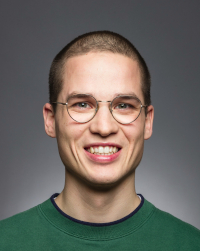

  

# Mark Niehues

Elsaßstr. 5  
44793 Bochum

<a href="tel:+49 1590 2486 709">+49 1590 2486 709</a> 
<a href="mailto:mark.niehues@posteo.de">mark.niehues@posteo.de</a> 

## Ausbildung

`Dez 2017 - Aug 2020`
__B.Sc. Informatik__
- _Fu Berlin_
- Für die Bachelorarbeit wurde ein Streckenfindungsalgorithmus entwickelt und evaluiert, der die Fahrzeit speziell für elektornisch betriebene Fahrzeuge optimiert.

`Sep 2016 - Dez 2017`
__M.Sc. Computational Sciences (ohne Abschluss)__
- _Fu Berlin_
- Es wurden vor allem numerische und statistische Themenfelder betrachtet. Beispielsweise der Entwurf einer einfachen Teilchensimulation und eines Klimamodelles. Hierzu wurden vor allem die numerischen Python Bibliothenken Numpy, Pandas und SciPy verwendet. Ich habe den Master nicht abgeschlossen. Stattdessen wechselte ich nach zwei Semestern in den Bachelor Studiengang Informatik, der meinen Interessen mehr entsprach.

`Okt 2012 - Aug 2015`
__B.Sc. in Physik__
- _TU Dresden_
- In der Bachelorarbeit wurde eine Methode entwickelt, um ein Gerät zur Härtemessung von dünnen Schichten („Nanoindenter“) zu kalibrieren. Dazu mussten Messdaten aufgenommen und mit Python verarbeitet werden. 

`Sep 1999 - Jun 2012`
__Abitur__
- _Gymnasium Remigianum Borken_

## Erfahrung

`Feb 2021 - April 2021`
__Fullstack Entwickler__
- _Werkbank GmbH_
- Entwicklung von Webanwendungen für mittelständische Unternehmen. Im Backend wurde eine REST Schnittstelle mittels Django implementiert. Im Frontend wurde React genutzt.

`Jul 2019 - Dez 2020`
__Studentischer Entwickler__
- _Carmeq GmbH_
- Entwicklung einer Webseite in Django deren Aufgabe es war, die Dokumentation und Evaluation von Kartendaten zu optimieren. Dazu musste ein komplexes SQL Datenbankschema entworfen werden. Meine Tätigkeitsgebiet erstreckte sich auf das Front- und Backend.
- Außerdem wurde meine Bachelorarbeit bei der Carmeq verfasst.
- Anschließend half ich dabei, eine Datenpipeline zu optimieren, die Kartendaten zusammenträgt, normalisiert und über eine REST-Schnittstelle zur Verfügung stellt.

`Jan 2018 - Jun 2019`
__Studentischer Entwickler__
- _Dev Crew Berlin UG_
- Fullstack Entwicklung in Python von kleinen bis mittelgroßen Event Webseiten, die über ein Backendsystem den Einladungsprozess für Veranstaltungen vereinfachen und optimieren. Zusätzlich entwickelte ich eine Reihe interner Werkzeuge. U.a. eine Website zur Administration der verwendeten Domains und E-Mail Postfächer, sowie eine Desktopanwendung, mit der Druckaufträge über eine REST-Schnittstelle automatisch gestartet und an bestimmte Drucker gesendet werden könnnen. Außerdem mussten (Linux-)Server administriert werden. 

`Sep 2016 - Dez 2017`
__Studentische Hilfskraft__
- _FU Berlin - Meteorological Institute_
- Unterstützung des Systemandimistratiors. Dies umfasste die Wartung der Desktopworkstations (Linux/Debian) und Server sowie die Entwicklung kleinere Tools für interne Aufgaben. 

`Aug 2016 - Sep 2016`
__Praktikum__
- _FU Berlin - Meteorological Institute_
- Kompilierung einer neuen Simulationssoftware und systematische Evaluation der Veränderungen im Vergleich zur derzeitigen Software.

`Dez 2014 - Dez 2015`
__Studentische Hilfskraft__
- _Fraunhofer IKTS Dresden_
- Planung, Durchführung und Auswertung von Experimenten zur Bestimmung von Materialparametern wie Härte und Elastizität dünner Schichten. Die Evaluation wurde in Python mit den Frameworks Numpy und SciPy durchgeführt.

## Sprachen

- Deutsch (Muttersprache)
- Englisch (Fließend)
- Spanisch (Grundlagen)

## Weiteres Engagement

`Jun 2019`
__Erfogreiche Teilnahme an einem Hackathon__
- _Bundesministerium für Familie, Senioren, Frauen und Jugend_
- Das Ministerium veranstaltete einen Hackathon, um neue Ideen zu entwickeln, die gesellschaftliche Probleme auf innovative Art lösen können. Die Gruppe, deren Teil ich gewesen bin, entwarf ein Konzept für die OpenData-Seite des Ministeriums.

## Über mich

- Ich nutze meine Freizeit entweder zum Lesen, Sport treiben (Kung Fu) oder Meditieren. Wenn ich mal länger frei habe (und meine Freundin am besten auch), suche ich mir ein interessantes Ziel heraus und mache mich zu Fuß oder mit dem Fahrrad auf den Weg. Generell würde ich mich als ruhigen und aufgeschlossenen Mitmenschen beschreiben.  
